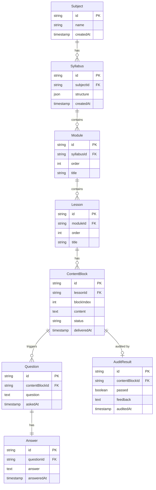

# Personal Tutor App - Architecture Plan

## High-Level Architecture

```mermaid
flowchart TB
    subgraph client [Frontend - Next.js]
        UI[React Components]
        SyllabusView[Syllabus View]
        LessonView[Lesson View]
        QASidebar[Q&A Sidebar]
        HistoryView[Q&A History]
    end

    subgraph api [Next.js API Routes]
        SubjectAPI[/api/subjects]
        SyllabusAPI[/api/syllabus]
        LessonAPI[/api/lessons]
        ContentAPI[/api/content]
        QAAPI[/api/qa]
        AuditAPI[/api/audit]
    end

    subgraph ai [LangChain.js Services]
        SyllabusGen[Syllabus Generator]
        ContentGen[Content Generator]
        QAGen[Q&A Generator]
        AuditModel[Audit Model]
    end

    subgraph data [Data Layer]
        DB[(Supabase/PostgreSQL)]
    end

    UI --> SyllabusView
    UI --> LessonView
    SyllabusView --> SubjectAPI
    SyllabusView --> SyllabusAPI
    LessonView --> ContentAPI
    LessonView --> QAAPI
    QASidebar --> QAAPI
    HistoryView --> QAAPI

    SubjectAPI --> SyllabusGen
    SyllabusAPI --> SyllabusGen
    ContentAPI --> ContentGen
    QAAPI --> QAGen
    AuditAPI --> AuditModel

    SyllabusGen --> DB
    ContentGen --> DB
    QAGen --> DB
    AuditModel --> DB
```

---

## Tech Stack (Frontend-Dev Friendly)

| Layer          | Choice                                  | Rationale                                                                       |
| -------------- | --------------------------------------- | ------------------------------------------------------------------------------- |
| **Framework**  | Next.js 14+ (App Router)                | Single codebase, API routes built-in, excellent DX                              |
| **Deployment** | Vercel                                  | Zero config, free tier, Git push = deploy                                        |
| **Database**   | Supabase (PostgreSQL) + Drizzle ORM     | Hosted Postgres with visual dashboard, built-in auth, generous free tier; Drizzle for type-safe queries |
| **AI**         | LangChain.js + OpenAI (or Anthropic)    | LangChain abstracts provider switching; streaming support                       |
| **Auth**       | Optional: Supabase Auth                 | Built-in; skip initially for single-user, enable when opening to others         |

---

## Data Model



---

## Core User Flows

### 1. Create Syllabus
- **Route:** `POST /api/subjects/[id]/syllabus`
- User enters subject (e.g., "Linear Algebra") → stored as Subject
- LangChain generates syllabus structure (modules + lessons) as JSON
- Stored in `Syllabus.structure` and `Module`/`Lesson` tables

### 2. Lesson Content Delivery (Block-by-Block)
- **Route:** `POST /api/lessons/[id]/content` (streaming)
- User requests next block → LangChain streams content
- Each block saved to `ContentBlock` with `blockIndex`
- Frontend uses `fetch` + `ReadableStream` or Server-Sent Events (SSE) for streaming

### 3. Q&A About a Block
- **Route:** `POST /api/content-blocks/[id]/questions`
- User asks question → linked to `contentBlockId`
- Answer generated via LangChain, stored in `Answer`
- Sidebar fetches Q&A for current block: `GET /api/content-blocks/[id]/qa`

### 4. Q&A History (Syllabus Level)
- **Route:** `GET /api/syllabus/[id]/qa-history`
- Returns all Q&A across all lessons, grouped by block/lesson
- Displayed in a collapsible panel or modal from syllabus view

### 5. Content Audit (Background)
- **Route:** `POST /api/content-blocks/[id]/audit` (or cron/webhook)
- Separate LangChain chain with a "fact-checker" or "validator" prompt
- Stores `AuditResult`; can surface warnings in UI if `passed: false`

---

## Project Structure

```
personal-tutor/
├── app/
│   ├── layout.tsx
│   ├── page.tsx                    # Landing: enter subject
│   ├── syllabus/[id]/
│   │   └── page.tsx                # Syllabus view + Q&A history
│   ├── lesson/[id]/
│   │   └── page.tsx                # Lesson view + content blocks + Q&A sidebar
│   └── api/
│       ├── subjects/
│       │   ├── route.ts            # POST create subject
│       │   └── [id]/
│       │       └── syllabus/route.ts  # POST generate syllabus
│       ├── lessons/
│       │   └── [id]/
│       │       └── content/route.ts   # POST stream next block
│       ├── content-blocks/
│       │   └── [id]/
│       │       ├── questions/route.ts # POST ask, GET list Q&A
│       │       └── audit/route.ts     # POST trigger audit
│       └── syllabus/
│           └── [id]/
│               └── qa-history/route.ts # GET all Q&A
├── lib/
│   ├── db/
│   │   ├── schema.ts               # Drizzle schema
│   │   └── index.ts                # DB client
│   ├── ai/
│   │   ├── syllabus-generator.ts   # LangChain chain for syllabus
│   │   ├── content-generator.ts    # LangChain chain for blocks
│   │   ├── qa-generator.ts         # LangChain chain for Q&A
│   │   └── audit-chain.ts          # LangChain chain for audit
│   └── streaming.ts                # SSE/stream helpers
├── components/
│   ├── SyllabusTree.tsx            # Modules + lessons tree
│   ├── ContentBlock.tsx            # Renders one block
│   ├── QASidebar.tsx               # Sidebar Q&A per block
│   └── QAHistoryPanel.tsx         # Syllabus-level Q&A list
├── drizzle.config.ts
├── package.json
└── .env.local                     # OPENAI_API_KEY, DATABASE_URL, NEXT_PUBLIC_SUPABASE_*
```

---

## Supabase Setup

**Database client:** Use `postgres` package with Drizzle. For Supabase Connection Pooler (transaction mode), set `prepare: false` in the connection config.

**Env vars:**
- `DATABASE_URL` — from Supabase Dashboard → Project Settings → Database → Connection string (URI, Transaction pooler)
- `NEXT_PUBLIC_SUPABASE_URL` — for client-side Supabase features (auth, realtime) if needed later
- `NEXT_PUBLIC_SUPABASE_ANON_KEY` — same
- `SUPABASE_SERVICE_ROLE_KEY` — for admin operations from API routes (bypasses RLS)

**Drizzle config:** Set `dialect: 'postgresql'` and `dbCredentials: { url: process.env.DATABASE_URL }` in `drizzle.config.ts`.

---

## Deployment Checklist

1. **Vercel:** Connect GitHub repo → auto-deploy on push
2. **Supabase:** Create project at [supabase.com](https://supabase.com), copy `DATABASE_URL` (Transaction pooler) and add to Vercel env
3. **OpenAI:** Add `OPENAI_API_KEY` to Vercel env
4. **Migrations:** Run `drizzle-kit push` or `drizzle-kit generate` + `migrate` in build step or manually before first deploy

---

## Simplifications for Single-User Start

- **No auth:** Rely on single user; enable Supabase Auth when opening to others
- **Local dev:** Supabase offers a local dev setup via CLI, or use a free hosted project for both dev and prod
- **Audit on-demand:** Trigger audit via a "Verify" button instead of automatic background job (avoids cron setup)
- **No rate limiting:** Add later if needed

---

## Recommended Implementation Order

1. **Scaffold:** Next.js app, Drizzle + Supabase, basic schema
2. **Subject + Syllabus:** Create subject, implement syllabus generator, display tree
3. **Lesson + Content:** Block-by-block content delivery with streaming
4. **Q&A:** Questions linked to blocks, sidebar UI
5. **Q&A History:** Syllabus-level history view
6. **Audit:** Audit chain + optional UI indicator
7. **Deploy:** Vercel + env vars, test production
