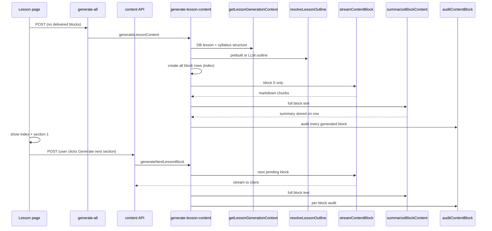
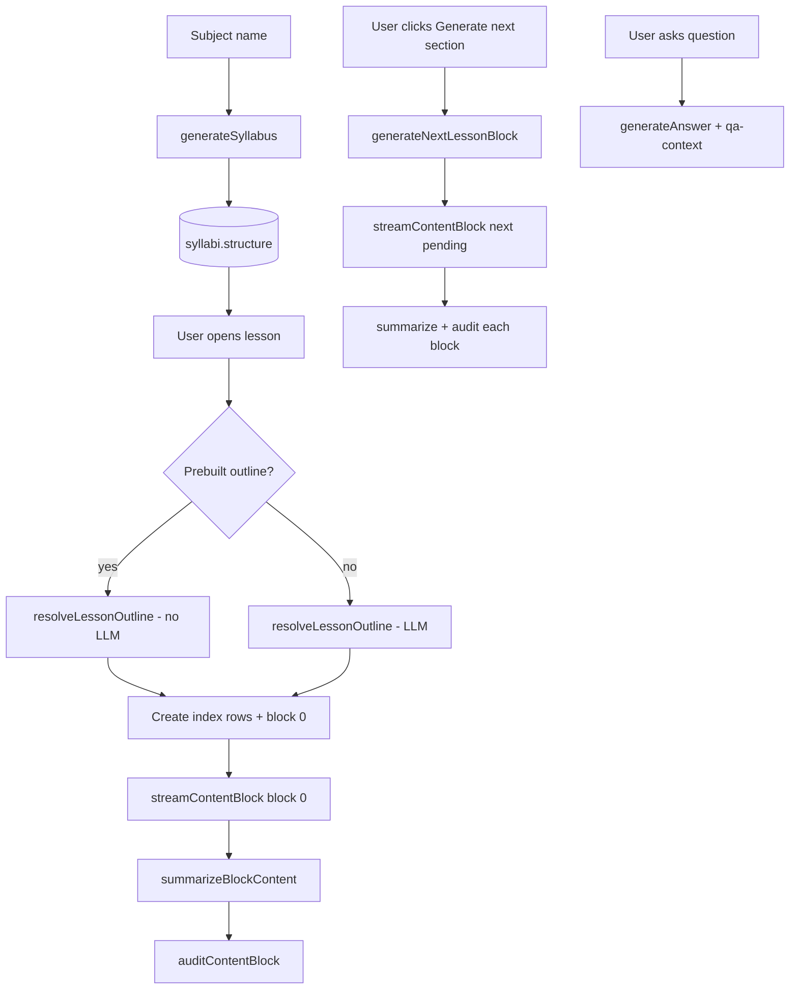

# Personal Tutor — AI Behavior & Features

This document describes how the app uses AI today: what controls syllabus and lesson scope, what context each model call receives, how features work end-to-end, and how the codebase reduces token use while keeping accuracy and cohesion across the course.

---

## Table of contents

1. [How extent and context are determined](#how-extent-and-context-are-determined)
2. [Syllabus structure (stored JSON)](#syllabus-structure-stored-json)
3. [Lesson content pipeline](#lesson-content-pipeline)
4. [Feature reference](#feature-reference)
5. [AI architecture](#ai-architecture)
6. [Legacy syllabi](#legacy-syllabi)
7. [Key file index](#key-file-index)

---

## How extent and context are determined

### Syllabus creation

| Aspect | Behavior |
|--------|----------|
| **User input** | Subject name (home page). Optional **topics to include** textarea on the subject page (focus areas, exam alignment, prerequisites, etc.). |
| **Trigger** | User clicks **Generate Syllabus** on the subject page (`POST /api/subjects/[id]/syllabus`). |
| **AI input** | `subject.name` plus optional `topicsDescription` from the request body. |
| **AI model** | `MODEL_STRUCTURED` (`gpt-4o-mini`), JSON via `invoke-json.ts` (`response_format: json_object`), `SYLLABUS_MAX_TOKENS` (16000). |
| **Extent (modules / lessons)** | **Fixed calendar shape:** 4 modules (weeks) × 5–7 lessons (study days). Zod enforces `modules.length === 4` and lessons per module in range. |
| **Per-lesson plan** | Each lesson includes `objective` (1–2 sentences, certification depth), `blockCount` (4–10), and block `titles[]` for later content generation. |
| **Course-wide context** | `curriculumBrief` (300–500 words): certificate outcomes, weekly arc, assessment readiness, progression. |
| **Hard limits** | Modules: exactly 4. Lessons per module: 5–7. Blocks per lesson: 4–10 (Zod). See `src/lib/ai/course-structure.ts`. |
| **Persistence** | Full `SyllabusStructure` in `syllabi.structure` (JSON) plus normalized `modules` and `lessons` rows (titles only in DB). |

**Implication:** One large syllabus call upfront (~20–28 lessons) replaces many small outline calls later and gives every lesson a shared certificate-level narrative.

**Sources:** `src/lib/ai/syllabus-generator.ts`, `src/lib/ai/syllabus-types.ts`, `src/app/api/subjects/[id]/syllabus/route.ts`

---

### Lesson content creation

| Aspect | Behavior |
|--------|----------|
| **User input** | None for the first section; user clicks **Generate next section** for later sections. |
| **Initial trigger** | Opening a lesson with no delivered blocks calls `POST /api/lessons/[id]/content/generate-all` → `generateLessonContent()`. |
| **On-demand trigger** | User clicks **Generate next section** → `POST /api/lessons/[id]/content` → `generateNextLessonBlock()` (streams to the client). |
| **Orchestration** | `src/lib/ai/generate-lesson-content.ts` (`generateLessonContent`, `generateBlockAtIndex`, `generateNextLessonBlock`). |
| **Step 1 — Outline / index** | `resolveLessonOutline(ctx)`: use prebuilt outline from `syllabi.structure` when valid; otherwise one LLM call. All block rows are created upfront (`status: pending`, titles from outline) so the lesson index is visible immediately. |
| **Step 2 — First block** | On initial open, only block 0 is generated: `streamContentBlock` → `summarizeBlockContent` → save `content` + `summary` → `status: delivered`. |
| **Step 3 — Later blocks** | One block at a time on user request. Each call fills the next `pending` placeholder row (does not append new rows). |
| **Per-block size** | Prompt targets certificate-depth, multi-section content (~3–6 booklet pages of density); hard cap `CONTENT_MAX_TOKENS` (6000). |
| **Cross-lesson context** | **Yes.** `curriculumBrief`, position in course, previous/next lesson titles, this lesson’s `objective`. |
| **Within-lesson context** | **Summaries only** from prior **delivered** blocks (`content_blocks.summary`), not full prior markdown. |
| **Outline in prompt** | **Slim slice:** current, previous, and next block titles + index/count — not the full title list every time. |
| **Audit** | Every generated block is auto-audited after generation (`auditContentBlock`). |
| **Resume** | If block 0 failed partway, reopening the lesson retries via `generate-all`. Already-`delivered` blocks are never regenerated. |

**Implication:** Users see the lesson index and first section quickly; later sections stay cohesive via summaries + slim outline. Cross-lesson cohesion still comes from the curriculum brief and positional context, without sending the entire syllabus JSON into every block prompt.

**Sources:** `src/lib/ai/generate-lesson-content.ts`, `src/lib/ai/lesson-context.ts`, `src/lib/ai/content-generator-stream.ts`, `src/app/api/lessons/[id]/content/generate-all/route.ts`, `src/app/api/lessons/[id]/content/route.ts`, `src/app/lesson/[id]/page.tsx`

---

## Syllabus structure (stored JSON)

New syllabi persist this shape in `syllabi.structure` (validated at generation time):

```json
{
  "curriculumBrief": "300-500 word certificate-level course overview...",
  "modules": [
    {
      "title": "Module title",
      "lessons": [
        {
          "title": "Lesson title",
          "objective": "One sentence learning goal",
          "blockCount": 5,
          "titles": ["Intro", "Core idea", "Example", "Practice", "Summary"]
        }
      ]
    }
  ]
}
```

| Field | Used when |
|-------|-----------|
| `curriculumBrief` | Every lesson outline fallback and every content block |
| `objective` | Lesson content + outline fallback prompts |
| `blockCount` / `titles` | Skip per-lesson outline LLM call; drive block rows and prompts |

Normalized tables (`modules`, `lessons`) store only `title` and `order`; the JSON is the source of truth for objectives and block plans.

---

## Lesson content pipeline



### Context assembly (`lesson-context.ts`)

For a lesson, the app loads:

- `curriculumBrief` from `syllabi.structure`
- `positionLine` — e.g. `Module 2 of 5, Lesson 3 of 4 (lesson 8 of 24 in course)`
- `previousLessonTitle` / `nextLessonTitle` from ordered modules + lessons
- `lessonObjective` and `prebuiltOutline` from the matching entry in `structure.modules[m].lessons[l]`

`formatCurriculumContext()` turns this into a compact string for prompts.

### Block generation (`content-generator-stream.ts`)

Each call receives:

| Input | Purpose |
|-------|---------|
| `lessonTitle` | Topic anchor |
| `slimOutline` | Prev / current / next block titles, index, count |
| `previousSummaries` | What earlier blocks already taught (50–120 words each) |
| `curriculumContext` | Brief + position + neighbors + objective |

System prompt instructs: fact-dense prose, no filler, stay scoped to this block, align with course position, do not steal topics from later lessons.

### Summaries (`block-summary.ts`)

After each block is written, a small `MODEL_STRUCTURED` call produces a factual summary (`SUMMARY_MAX_TOKENS` 450, prompt target 150–280 words). Stored in `content_blocks.summary` for resume and next-block context.

### Audit (`audit-chain.ts`)

| Rule | Behavior |
|------|----------|
| All blocks | Auto-audited after each block is generated |
| Timing | One `auditContentBlock` call per generated block (not deferred to end of lesson) |
| Manual | `POST /api/content-blocks/[id]/audit` always available |

Audit never edits content; results go to `audit_results`. `auditContentBlocksBatch` remains available for batch/manual use but is not used in the default lesson flow.

---

## Feature reference

### Authentication & multi-user isolation

- **Google sign-in** via Supabase Auth (`/login`, `/auth/callback`).
- **Middleware** (`src/middleware.ts`) redirects unauthenticated users to `/login`.
- **Ownership** (`src/lib/auth.ts`): `subjects` / `syllabi` by `userId`; lessons and blocks via `lesson → module → syllabus → userId`.
- Missing Supabase env vars: middleware no-ops (auth disabled).

### Home page — resume & new subjects

- **Route:** `/`
- Lists syllabi (`GET /api/syllabi`) with subject names.
- **New subject:** `POST /api/subjects` `{ name }` → `/subject/[id]`.
- Delete syllabus from home.

### Subject page — multiple syllabi

- **Route:** `/subject/[id]`
- Auto-generates first syllabus when none exist.
- Manual “Generate Syllabus” adds another for the same subject.

### Syllabus view — tree & progress

- **Route:** `/syllabus/[id]`
- **API:** `GET /api/syllabi/[id]` — modules, lessons, progress from `block_reads` (counts **delivered** blocks only).
- **Q&A history:** `GET /api/syllabus/[id]/qa-history` — all Q&A in the syllabus (no AI).

### Lesson view — content blocks

- **Route:** `/lesson/[id]`
- **API:** `GET /api/lessons/[id]` — all block rows (index + content), audit flag, read state, `moduleTitle`, `syllabusId`.
- **Initial generate:** `generate-all` when no delivered blocks — creates the full index (pending rows) and generates block 0 only.
- **On-demand generate:** **Generate next section** calls `POST /api/lessons/[id]/content` and streams the next pending block into its placeholder row.
- **UI:** Lesson overview lists all planned sections; pending ones marked “not generated yet”. Only delivered blocks render as readable content.
- **Read tracking:** `PATCH /api/content-blocks/[id]/read` → lesson/syllabus progress % (based on delivered blocks).

### Q&A (per block)

- **POST** `/api/content-blocks/[id]/questions` → `generateAnswer(block.content, question)`.
- **Context:** Full block if ≤ `QA_FULL_CONTENT_THRESHOLD` (12000 chars); otherwise `selectRelevantContext()` picks paragraphs by keyword overlap with the question (`qa-context.ts`).
- **Model:** `MODEL_STRUCTURED`, temperature `0.3`.

### Q&A history (syllabus level)

- Aggregates Q&A across all blocks in the syllabus with `lessonTitle` and `blockIndex`.

### Incremental content API

- **Route:** `POST /api/lessons/[id]/content`
- Finds the next `pending` block row, streams content into it, then summarizes and audits. Uses the same context stack: curriculum, slim outline, prior delivered summaries, `max_tokens`, and per-block audit.
- Used by the lesson page **Generate next section** button.

### Data model

```
Subject → Syllabus (structure JSON) → Module → Lesson → ContentBlock
                                              ↓
                         summary (text), content, title, status
                                              ↓
                                    Question → Answer
                                    AuditResult, BlockRead (per user)
```

| Table / column | Notes |
|----------------|-------|
| `syllabi.structure` | `SyllabusStructure` JSON (brief + per-lesson outlines) |
| `content_blocks.summary` | Compact prior-block context; requires migration `0002_content_block_summary.sql` |
| `content_blocks.status` | `pending` for index placeholders and not-yet-generated sections; `delivered` when content exists |

---

## AI architecture

### Model tiers (`models.ts`)

| Constant | Model | Used for |
|----------|-------|----------|
| `MODEL_STRUCTURED` | `gpt-4o-mini` | Syllabus, outlines, summaries, audit, Q&A |
| `MODEL_CONTENT` | `gpt-4.1` | Block prose (streaming) |

Structured tasks stay on the cheaper tier; lesson blocks use the higher-quality model.

### Token limits

| Constant | Value | Role |
|----------|-------|------|
| `CONTENT_MAX_TOKENS` | 6000 | Cap per content block (booklet-depth sections) |
| `SUMMARY_MAX_TOKENS` | 450 | Cap per block summary |
| `SYLLABUS_MAX_TOKENS` | 16000 | Cap for syllabus JSON generation |
| `QA_FULL_CONTENT_THRESHOLD` | 12000 | When to compress Q&A input |
| `AUDIT_BATCH_CONTENT_CHARS` | 8000 | Batch audit truncation per block |

### Course shape (`course-structure.ts`)

| Constant | Value |
|----------|-------|
| `COURSE_WEEKS` | 4 (one module per week) |
| `LESSONS_PER_WEEK_MIN` / `MAX` | 5 / 7 (one lesson per study day) |
| `LESSON_BLOCKS_MIN` / `MAX` | 4 / 10 (sections per daily lesson) |

### Call graph (typical new syllabus + one lesson)



| Step | Function | When skipped |
|------|----------|--------------|
| Syllabus | `generateSyllabus` | Never (per syllabus) |
| Lesson outline | `resolveLessonOutline` | When `structure` has valid `blockCount` + `titles` |
| Index rows | `ensureBlockRows` | When all rows already exist |
| Block content | `streamContentBlock` | One block per user action (block 0 on open; rest on demand) |
| Summary | `summarizeBlockContent` | After each generated block (reused if already stored) |
| Audit | `auditContentBlock` | After each generated block |
| Q&A | `generateAnswer` | On user question only |

**Cost shape:** Syllabus creation is one large structured call. Opening a lesson costs O(1) block generation plus outline/index setup. Each **Generate next section** adds one content + summary + audit call — with **O(k)** context where *k* is the number of already-delivered blocks (summaries), not O(n²) full text.

### Structured JSON (`invoke-json.ts`)

Syllabus, outline fallback, and audit use OpenAI JSON mode with Zod parse — not LangChain `StructuredOutputParser` format instructions.

### Design constraints (avoided patterns)

| Avoided | Why |
|---------|-----|
| Full prior block text in prompts | Token explosion on later blocks |
| Full outline list in every block prompt | Redundant; replaced by slim slice |
| Generating all blocks on lesson open | Long wait before any content; replaced by index + first block, then on demand |
| Parallel block generation without shared summaries | Risk of repetition and contradiction |
| Raw full `structure` JSON in every block prompt | Noise; curriculum brief + position instead |

---

## Legacy syllabi

Syllabi created before the optimized syllabus schema may have:

```json
{ "modules": [{ "title": "...", "lessons": [{ "title": "..." }] }] }
```

| Missing field | Fallback |
|---------------|----------|
| `curriculumBrief` | Empty string; positional context still works |
| `objective` | Omitted from prompts |
| `blockCount` / `titles` | `resolveLessonOutline` runs an LLM call on first lesson open |

No migration of old JSON is required; regenerate a syllabus to get the full pipeline.

**Database:** Run `npm run db:push` (or `drizzle/0002_content_block_summary.sql`) so `content_blocks.summary` exists.

---

## Key file index

| Area | Path |
|------|------|
| Course shape constants | `src/lib/ai/course-structure.ts` |
| Model constants | `src/lib/ai/models.ts` |
| JSON LLM helper | `src/lib/ai/invoke-json.ts` |
| Syllabus types / schema | `src/lib/ai/syllabus-types.ts` |
| Syllabus generation | `src/lib/ai/syllabus-generator.ts` |
| Lesson context builder | `src/lib/ai/lesson-context.ts` |
| Outline resolution | `src/lib/ai/resolve-lesson-outline.ts` |
| Content orchestration | `src/lib/ai/generate-lesson-content.ts` (`generateLessonContent`, `generateBlockAtIndex`, `generateNextLessonBlock`) |
| Content streaming | `src/lib/ai/content-generator-stream.ts` |
| Block summaries | `src/lib/ai/block-summary.ts` |
| Audit + batch | `src/lib/ai/audit-chain.ts` |
| Q&A | `src/lib/ai/qa-generator.ts` |
| Q&A context compression | `src/lib/ai/qa-context.ts` |
| Initial generate API | `src/app/api/lessons/[id]/content/generate-all/route.ts` |
| On-demand block API | `src/app/api/lessons/[id]/content/route.ts` |
| Lesson page UI | `src/app/lesson/[id]/page.tsx` |
| Syllabus API | `src/app/api/subjects/[id]/syllabus/route.ts` |
| DB schema | `src/lib/db/schema.ts` |
| Auth | `src/lib/auth.ts`, `src/middleware.ts` |

---

*Update this file when generation prompts, `SyllabusStructure`, API contracts, or token constants change.*
